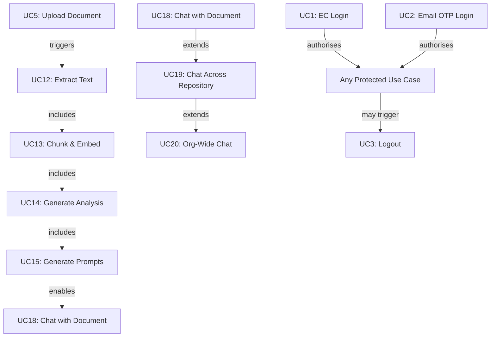

# DocTel – Use Case Diagram
## ZETDC Document Intelligence Platform
**Version:** 1.0 | **Date:** May 2026

---

## Actors

| Actor | Description |
|---|---|
| **Viewer** | Read-only ZETDC staff member |
| **Analyst** | ZETDC staff who uploads and analyses documents |
| **Admin** | System administrator with full access |
| **Ollama (Local AI)** | Local LLM / embedding service (Tier 2) |
| **Gemini API** | Google Gemini cloud AI (Tier 2b) |
| **Active Directory** | ZETDC LDAP/AD server for EC number auth |

---

## Use Case Diagram

```mermaid
flowchart LR
    %% ── Actors ──────────────────────────────────────────────────
    Viewer(["👁️ Viewer"])
    Analyst(["👤 Analyst"])
    Admin(["🔧 Admin"])
    Ollama(["🤖 Ollama\nLocal AI"])
    Gemini(["☁️ Gemini API"])
    AD(["🏢 Active\nDirectory"])

    %% ── System Boundary ─────────────────────────────────────────
    subgraph DocTel ["⬛  DocTel – ZETDC DocIntel System"]

        subgraph AUTH ["🔐 Authentication"]
            UC1["Login via EC Number\n& Password"]
            UC2["Login via Email OTP"]
            UC3["Logout / Revoke Token"]
            UC4["Refresh Session Token"]
        end

        subgraph DOCS ["📄 Document Management"]
            UC5["Upload Document"]
            UC6["View Document Library"]
            UC7["Search & Filter Documents"]
            UC8["Download Original File"]
            UC9["Delete Document"]
            UC10["Tag Document"]
            UC11["Move Document to Repository"]
        end

        subgraph INGEST ["⚙️ Ingestion Pipeline"]
            UC12["Auto-Extract Text\n(PDF/DOCX/TXT/Image)"]
            UC13["Chunk & Embed Text"]
            UC14["Generate Analysis\n(Summary / Entities / Topics)"]
            UC15["Generate Suggested Prompts"]
            UC16["Monitor Ingest Progress\n(SSE Stream)"]
            UC17["Retry Failed Ingestion"]
        end

        subgraph CHAT ["💬 AI Copilot (RAG Chat)"]
            UC18["Ask Question About Document"]
            UC19["Ask Question Across Repository"]
            UC20["Ask Organisation-Wide Question"]
            UC21["View Chat History"]
            UC22["Create / Resume Chat Session"]
            UC23["Select AI Model per Session"]
            UC24["Pin Reference Documents"]
            UC25["Retry Failed Message"]
        end

        subgraph ANALYSE ["🔬 Analysis Toolbox"]
            UC26["Summarise Multiple Documents"]
            UC27["Extract Structured Data"]
            UC28["Compare Two Documents"]
            UC29["Classify Documents"]
            UC30["Generate Mermaid Diagram"]
            UC31["Build CSV Chart"]
            UC32["Generate Policy Draft"]
        end

        subgraph COLLAB ["🤝 Collaboration"]
            UC33["Create Repository"]
            UC34["Invite / Remove Team Members"]
            UC35["View Activity Feed"]
            UC36["Share Document View"]
        end

        subgraph OUTPUT ["📤 Outputs & Exports"]
            UC37["View Generated Outputs"]
            UC38["Export Output (PDF/DOCX/JSON)"]
        end

        subgraph TRAINING ["🧠 Training Room"]
            UC39["Trigger LoRA Fine-Tuning"]
            UC40["Monitor Training Progress"]
            UC41["View Adapter History"]
            UC42["Promote Active Adapter"]
        end

        subgraph ADMIN_UC ["⚙️ Administration"]
            UC43["Manage System Settings"]
            UC44["View Settings Audit Log"]
            UC45["Backup / Restore Settings"]
            UC46["Manage Users & Roles"]
            UC47["Manage Prompt Templates"]
            UC48["Pull / Install AI Models"]
            UC49["Reindex Document Store"]
            UC50["View Processing Status"]
        end

    end

    %% ── Viewer Associations ──────────────────────────────────────
    Viewer --> UC2
    Viewer --> UC3
    Viewer --> UC6
    Viewer --> UC7
    Viewer --> UC8
    Viewer --> UC18
    Viewer --> UC21
    Viewer --> UC22
    Viewer --> UC37

    %% ── Analyst Associations (inherits Viewer) ───────────────────
    Analyst --> UC1
    Analyst --> UC2
    Analyst --> UC3
    Analyst --> UC4
    Analyst --> UC5
    Analyst --> UC6
    Analyst --> UC7
    Analyst --> UC8
    Analyst --> UC9
    Analyst --> UC10
    Analyst --> UC11
    Analyst --> UC16
    Analyst --> UC17
    Analyst --> UC18
    Analyst --> UC19
    Analyst --> UC20
    Analyst --> UC21
    Analyst --> UC22
    Analyst --> UC23
    Analyst --> UC24
    Analyst --> UC25
    Analyst --> UC26
    Analyst --> UC27
    Analyst --> UC28
    Analyst --> UC29
    Analyst --> UC30
    Analyst --> UC31
    Analyst --> UC32
    Analyst --> UC33
    Analyst --> UC34
    Analyst --> UC35
    Analyst --> UC36
    Analyst --> UC37
    Analyst --> UC38

    %% ── Admin Associations (inherits Analyst + Admin-only) ────────
    Admin --> UC39
    Admin --> UC40
    Admin --> UC41
    Admin --> UC42
    Admin --> UC43
    Admin --> UC44
    Admin --> UC45
    Admin --> UC46
    Admin --> UC47
    Admin --> UC48
    Admin --> UC49
    Admin --> UC50

    %% ── External System Associations ─────────────────────────────
    UC1  --> AD
    UC12 --> Ollama
    UC13 --> Ollama
    UC14 --> Ollama
    UC18 --> Ollama
    UC19 --> Ollama
    UC20 --> Ollama
    UC14 --> Gemini
    UC18 --> Gemini
    UC30 --> Ollama
```

---

## Use Case Summary Table

| ID | Use Case | Primary Actor | Secondary Actor |
|---|---|---|---|
| UC1 | Login via EC Number & Password | Analyst / Admin | Active Directory |
| UC2 | Login via Email OTP | Any User | — |
| UC3 | Logout / Revoke Token | Any User | — |
| UC4 | Refresh Session Token | Any User | — |
| UC5 | Upload Document | Analyst | — |
| UC6 | View Document Library | Any User | — |
| UC7 | Search & Filter Documents | Any User | — |
| UC8 | Download Original File | Any User | — |
| UC9 | Delete Document | Analyst / Admin | — |
| UC10 | Tag Document | Analyst | — |
| UC11 | Move Document to Repository | Analyst | — |
| UC12 | Auto-Extract Text | System | Ollama (OCR) |
| UC13 | Chunk & Embed Text | System | Ollama |
| UC14 | Generate Analysis | System | Ollama / Gemini |
| UC15 | Generate Suggested Prompts | System | Ollama |
| UC16 | Monitor Ingest Progress | Analyst | — |
| UC17 | Retry Failed Ingestion | Analyst | — |
| UC18 | Ask Question About Document | Any User | Ollama / Gemini |
| UC19 | Ask Across Repository | Analyst | Ollama |
| UC20 | Ask Organisation-Wide | Analyst | Ollama |
| UC21 | View Chat History | Any User | — |
| UC22 | Create / Resume Chat Session | Any User | — |
| UC23 | Select AI Model per Session | Any User | — |
| UC24 | Pin Reference Documents | Any User | — |
| UC25 | Retry Failed Message | Any User | — |
| UC26 | Summarise Multiple Documents | Analyst | Ollama |
| UC27 | Extract Structured Data | Analyst | Ollama |
| UC28 | Compare Two Documents | Analyst | Ollama |
| UC29 | Classify Documents | Analyst | Ollama |
| UC30 | Generate Mermaid Diagram | Analyst | Ollama |
| UC31 | Build CSV Chart | Analyst | — |
| UC32 | Generate Policy Draft | Analyst | Ollama |
| UC33 | Create Repository | Analyst | — |
| UC34 | Invite / Remove Team Members | Analyst / Admin | — |
| UC35 | View Activity Feed | Any User | — |
| UC36 | Share Document View | Analyst | — |
| UC37 | View Generated Outputs | Any User | — |
| UC38 | Export Output (PDF/DOCX/JSON) | Any User | — |
| UC39 | Trigger LoRA Fine-Tuning | Admin | Ollama |
| UC40 | Monitor Training Progress | Admin | — |
| UC41 | View Adapter History | Admin | — |
| UC42 | Promote Active Adapter | Admin | — |
| UC43 | Manage System Settings | Admin | — |
| UC44 | View Settings Audit Log | Admin | — |
| UC45 | Backup / Restore Settings | Admin | — |
| UC46 | Manage Users & Roles | Admin | — |
| UC47 | Manage Prompt Templates | Admin | — |
| UC48 | Pull / Install AI Models | Admin | Ollama |
| UC49 | Reindex Document Store | Admin | Ollama |
| UC50 | View Processing Status | Admin | — |

---

## Key Relationships

---

*End of Use Case Diagram*
