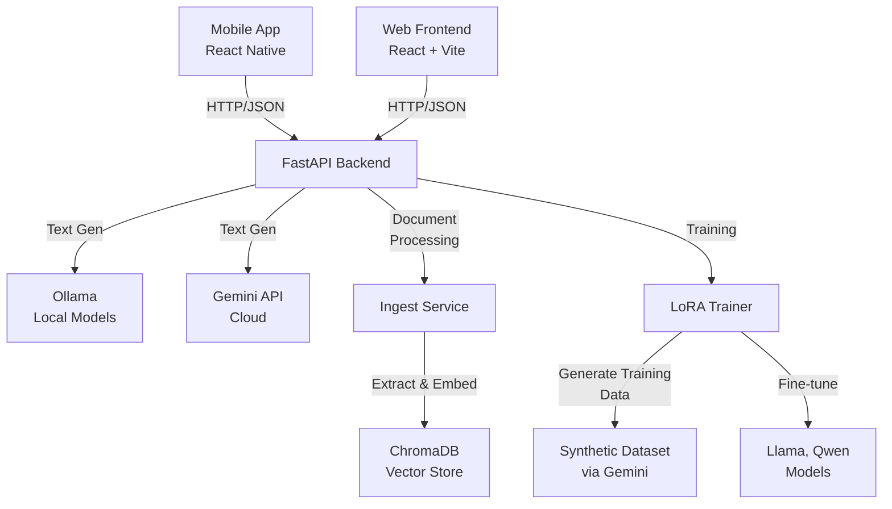

# DocIntel System Integration Diagnostic Report
**Generated:** April 23, 2026  
**Status:** Comprehensive System Assessment

---

## Executive Summary

This report assesses the DocIntel system across 5 critical areas:
1. ✅ **Gemini API Integration** – Partially complete
2. ⚠️ **Mobile API Connectivity** – Needs enhancement
3. ⚠️ **Transfer Learning (LoRA)** – Implemented but not fully connected
4. ✅ **Mermaid Diagram Generation** – Implemented
5. ❌ **CSV Dashboard & Charts** – Missing

---

## 1. Gemini API Integration Status

### Current Implementation ✅
- **Service:** `app/services/gemini_service.py`
- **Status:** Text generation only
- **Key Features:**
  - ✅ `async generate(prompt, system)` – Text generation via REST API
  - ✅ Model selection with fallback (`gemini-2.5-flash` default)
  - ✅ Error handling for rate limits, invalid keys, safety filters
  - ✅ Environment variable configuration (`GEMINI_API_KEY`, `GEMINI_MODEL`)
  - ✅ Integrated into model router (Tier 3 backup)
  - ✅ Available in model selector UI when configured

### What's Missing ❌
- **Document Ingestion Support**
  - Gemini API v1beta supports file uploads via `uploadFile()` endpoint
  - Current implementation: TEXT-ONLY
  - **Recommendation:** Extend to support PDFs, images, DOCX for direct analysis

- **Multimodal Capabilities**
  - Gemini supports vision (image analysis)
  - Not currently used for document OCR or image extraction
  - **Opportunity:** Use for fallback document analysis

- **Batch Processing**
  - No batch API for document ingestion
  - Single-request limit may bottleneck large document sets

### Implementation Needed

**File:** `app/services/gemini_service.py` – Add document ingestion:

```python
async def ingest_document_with_analysis(
    file_path: str,
    mime_type: str,
    prompt: str = "Summarize this document. Extract: title, key sections, main topics.",
) -> dict:
    """Analyze document directly via Gemini Files API."""
    # Upload file to Gemini
    # Call generateContent with file reference
    # Extract: summary, entities, topics
    pass
```

---

## 2. Mobile API Connectivity Status

### Current Implementation ⚠️
- **Mobile Client:** `mobile/src/api/client.ts`
- **Frontend Client:** `frontend/src/api/client.ts`

### Comparison

| Feature | Frontend | Mobile | Status |
|---------|----------|--------|--------|
| Base URL Config | `VITE_API_BASE_URL` | `EXPO_PUBLIC_API_BASE_URL` | ✅ Both configured |
| Auth Token Storage | `localStorage` | `AsyncStorage` | ✅ Platform-appropriate |
| Error Handling | Window events | Async callback | ⚠️ Different patterns |
| Request Interceptors | Global via `handleResponse` | Per-request in `handleResponse` | ⚠️ Inconsistent |
| Logout Flow | Event dispatch | Direct clear | ⚠️ Different patterns |
| API Endpoints | ✅ All supported | ⚠️ Only subset tested | ❌ Missing endpoint verification |

### Issues Identified

1. **Hardcoded fallback IP** – `172.16.4.60:8000` (Mobile)
   - Works for LAN but not flexible
   - Should use hostname discovery

2. **Missing endpoints in mobile**
   - No chat session creation
   - No document upload via FormData
   - No streaming response support
   - No multipart file upload

3. **No health check on startup**
   - Mobile doesn't verify backend availability
   - Could fail silently

### Implementation Needed

**File:** `mobile/src/api/client.ts` – Add missing features:

```typescript
// 1. Health check
export async function healthCheck(): Promise<boolean>

// 2. Document upload with FormData
export async function uploadDocument(formData: FormData): Promise<DocumentCreateResponse>

// 3. Streaming responses (for model pulls, etc.)
export async function* streamModels(...): AsyncGenerator<string>

// 4. Connection diagnostics
export function getConnectionDiagnostics(): { connected: boolean; latency: number; }
```

---

## 3. Transfer Learning (LoRA) & Model Training Status

### Current Implementation ✅
- **Trainer:** `app/training/lora_trainer.py`
- **Multi-model orchestration:** `app/services/multi_model_trainer.py`
- **Scheduler:** `app/training/training_scheduler.py`
- **Checkpoint management:** `app/training/checkpoint_manager.py`

### What Works ✅
- ✅ LoRA fine-tuning with PEFT + Transformers
- ✅ Support for TinyLlama, Llama-3.2, Qwen models
- ✅ QLoRA 4-bit quantization (optional)
- ✅ Multi-model parallel/sequential training
- ✅ Progress callbacks and thread-safe reporting
- ✅ Checkpoint management and adapter activation

### What's Missing ❌

1. **No Gemini as teacher model for transfer learning**
   - Could use Gemini-generated synthetic data
   - Missing: Gemini-powered synthetic data generation

2. **No document-to-training-data pipeline**
   - Ingested documents → Training dataset
   - Missing: Automatic JSONL generation from document chunks

3. **No transfer learning validation**
   - No before/after quality comparison
   - Missing: Validation metrics

### Implementation Needed

**Files:**
- `app/training/data_preparer.py` – Convert document chunks to training data
- `app/services/gemini_service.py` – Synthetic data generation
- `app/training/transfer_validator.py` – NEW – Validate improvements

---

## 4. Mermaid Diagram Generation Status

### Current Implementation ✅
- **Endpoints:**
  - `POST /api/flowchart` – Single diagram generation
  - `POST /api/flowchart/generate` – Batch diagram generation
  - `POST /api/flowchart/suggest` – Diagram suggestions

- **Integration:**
  - ✅ Integrated with RAG service (`force_diagram=True`)
  - ✅ Returns Mermaid code in `mermaid_code` field
  - ✅ System prompt instructs model to generate Mermaid syntax
  - ✅ Works with both Ollama and Gemini backends

- **Frontend Support:**
  - ✅ Frontend calls `flowchartGenerate()` from client
  - ✅ Mobile has types for diagram responses

### What's Missing ⚠️

1. **No diagram rendering UI**
   - Mermaid code generated but not displayed
   - Missing: `mermaid-js` library integration in frontend/mobile

2. **No diagram-from-CSV**
   - Could auto-generate flow diagrams from data relationships
   - Missing: CSV-to-diagram conversion

3. **No diagram export**
   - PNG/SVG export capability
   - Missing: Export endpoints

---

## 5. CSV Dashboard & Charts Status

### Current Implementation ❌
- **CSV Upload:** Minimal support in `POST /api/csv` endpoint
- **Chart Generation:** No chart library integration
- **Dashboard:** No analytics dashboard

### What's Missing ❌

1. **No chart library**
   - `plotly`, `matplotlib`, or `recharts` not used
   - No time-series, scatter, bar charts generated

2. **No CSV parsing pipeline**
   - CSV files uploaded but not analyzed
   - No data type detection (numeric, text, date)
   - No statistics generation

3. **No dashboard UI**
   - Frontend has no dashboard page
   - Mobile has no analytics screen

---

## 6. System Architecture Diagram



---

## Implementation Roadmap

### Phase 1: Enhance Gemini Integration (2-3 hours)
- [ ] Implement Gemini Files API for document analysis
- [ ] Add multimodal support (vision)
- [ ] Test document ingestion end-to-end

### Phase 2: Complete Mobile Connectivity (2-3 hours)
- [ ] Add missing API endpoints
- [ ] Implement health checks
- [ ] Add connection diagnostics UI

### Phase 3: CSV Dashboard & Charts (3-4 hours)
- [ ] Implement CSV parser with type detection
- [ ] Add chart generation (Plotly/Recharts)
- [ ] Create dashboard page (frontend + mobile)
- [ ] Add statistics calculation

### Phase 4: Transfer Learning Pipeline (2-3 hours)
- [ ] Create document-to-training-data converter
- [ ] Implement synthetic data generation via Gemini
- [ ] Add validation metrics

### Phase 5: Testing & Integration (2 hours)
- [ ] End-to-end integration tests
- [ ] Performance benchmarks
- [ ] Connection diagnostics

---

## Environment Variables Required

```env
# Gemini API (for document ingestion + synthetic data)
GEMINI_API_KEY=your_key_here
GEMINI_MODEL=gemini-2.5-flash

# Mobile connectivity
EXPO_PUBLIC_API_BASE_URL=http://your-machine-ip:8000
EXPO_PUBLIC_API_TIMEOUT_MS=30000

# CSV/Dashboard (new)
ENABLE_CSV_ANALYTICS=true
CHART_LIBRARY=plotly
MAX_CSV_ROWS=100000
```

---

## Testing Checklist

- [ ] Gemini API connects and accepts documents
- [ ] Gemini generates summaries for PDFs, images, DOCX
- [ ] Mobile app connects to backend via IP and hostname
- [ ] Mobile uploads documents successfully
- [ ] LoRA training uses Gemini synthetic data
- [ ] Mermaid diagrams render in frontend/mobile
- [ ] CSV files generate charts and dashboard
- [ ] All endpoints respond with correct schemas

