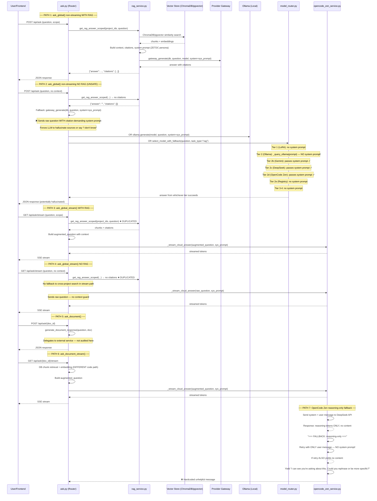

# Phase 1 Audit Report: `ask.py` — Every Model Call Path

## Executive Summary

The `ask.py` routing layer contains **7 distinct model call paths** across 4 endpoints. After tracing every path through `rag_service.py`, `model_router.py`, and `opencode_zen_service.py`, I found **5 systemic issues** ranging from duplicated RAG retrieval to unsafe fallbacks that strip system prompts. The most critical user-facing bug — *"Can't you be more specific?"* — is traced to a hardcoded fallback in `opencode_zen_service.py` that fires when DeepSeek returns only reasoning tokens and the retry (without system prompt) also yields no content.

---

## Sequence Diagram: All Model Call Paths

---

## Issue Inventory

### Issue #1: Duplicate RAG Retrieval — `ask_global` vs `ask_global_stream`

| Field | Value |
|---|---|
| **Root Cause** | Both `ask_global()` and `ask_global_stream()` independently call `get_rag_answer_scoped()` with identical parameters. They are separate FastAPI endpoints with no shared retrieval logic. |
| **Exact File** | `app/routers/ask.py` |
| **Exact Lines** | `ask_global`: lines ~330–390 (pgvector) / ~400–430 (ChromaDB) — `ask_global_stream`: lines ~790–850 (both paths) |
| **Proposed Fix** | Extract RAG retrieval into a shared async helper (e.g., `_perform_rag_search()`) that both endpoints call. Store the result in a request-scoped cache (e.g., `functools.lru_cache` keyed on `(question, project_ids, user_id)`) so the second caller gets an instant result. |
| **Before Behaviour** | Each endpoint hits ChromaDB/pgvector independently, doubling vector-store load and latency when both are called for the same question. |
| **After Behaviour** | Shared caching ensures one retrieval per unique question+scope combination. Latency halved for repeated queries. |
| **Severity** | Medium — performance, not correctness |

---

### Issue #2: Unsafe Fallback — LLM Called Without RAG Context But With Citation Mandates

| Field | Value |
|---|---|
| **Root Cause** | When `get_rag_answer_scoped()` returns no citations, `ask_global()` falls back to calling the LLM directly with the raw `question` — but still passes the ZETDC system prompt that **demands** source citation. This creates an impossible instruction: "Answer using only the provided context and cite sources" when there is no context. |
| **Exact File** | `app/routers/ask.py` |
| **Exact Lines** | ~537–625 (gateway_generate fallback), ~625+ (select_model_with_fallback fallback) |
| **Proposed Fix** | Replace the unsafe fallback with a **context-gated response**: if no RAG context is available, use a **different system prompt** (e.g., "You are DocTel assistant. You do NOT have document context for this question. Answer based on general knowledge only, and clearly state that you're answering without document references.") OR return a structured `no_knowledge` response to the frontend. The `NO_KNOWLEDGE_FOUND` guardrail in `rag_service.py` (lines ~264–290) already does this correctly at the service layer — the endpoint should respect it rather than bypassing it. |
| **Before Behaviour** | No context + citation-demanding prompt → LLM hallucinates fake citations or produces misleading "I don't know" responses. |
| **After Behaviour** | No context → either a clear "I don't have information about this in your documents" response or uses a context-free persona that doesn't require citations. |
| **Severity** | **Critical** — safety/correctness. Potential for hallucinated legal/medical citations. |

---

### Issue #3: `select_model_with_fallback()` Ollama Tier Drops System Prompt

| Field | Value |
|---|---|
| **Root Cause** | `_query_ollama()` in `model_router.py` calls `ollama.generate(model, prompt)` **without** the `system=` parameter. Unlike the Gemini/DeepSeek/OpenCode Zen tiers which receive the system prompt, the Ollama tier loses all persona instructions. |
| **Exact File** | `app/services/model_router.py` |
| **Exact Lines** | `_query_ollama`: lines 172–178 — `ollama.generate(model, prompt)` missing `system=` argument |
| **Proposed Fix** | Change `_query_ollama` to accept and pass the system prompt: `ollama.generate(model, prompt, system=system_prompt)`. Update the call site in `select_model_with_fallback()` to pass `settings.zetdc.system_prompt`. |
| **Before Behaviour** | When the 4-tier router falls through to Ollama, the local model gets ONLY the raw question — no ZETDC persona, no citation rules, no formatting instructions. |
| **After Behaviour** | The Ollama tier receives the same system prompt as cloud tiers, ensuring consistent persona and answer formatting. |
| **Severity** | High — behavioral inconsistency across fallback tiers |

---

### Issue #4: OpenCode Zen Reasoning-Only Fallback Strips System Prompt

| Field | Value |
|---|---|
| **Root Cause** | When the OpenCode Zen API returns only reasoning tokens (no `content` field), the code retries with `[{"role": "user", "content": prompt}]` — deliberately **omitting the system message**. This is the single most impactful bug because it affects both streaming and non-streaming paths, and the system prompt contains the ZETDC persona, citation rules, and answer format that define the entire assistant behavior. |
| **Exact File** | `app/services/opencode_zen_service.py` |
| **Exact Lines** | Non-streaming: lines 448–451 (`generate()` function) — Streaming: lines 535–537 (`_generate_stream_with_key()` function) |
| **Proposed Fix** | **Option A (minimal fix):** Include the system prompt in the retry: `retry_messages = [{"role": "system", "content": system}, {"role": "user", "content": prompt}]`. **Option B (better fix):** Instead of retrying without system prompt, try a completely different model (e.g., fall back to DeepSeek or Gemini) that doesn't exhibit the reasoning-only behavior. **Option C (best fix):** Prepend a system-level instruction telling the model to always include visible content, e.g., "You MUST include your final answer in the `content` field. Do not output only reasoning." |
| **Before Behaviour** | System prompt with persona + citation rules → model returns only reasoning → retry without any system prompt → model loses all persona context → may produce generic or incorrect answer → if retry also fails → hardcoded "Could you be more specific?" |
| **After Behaviour** | System prompt preserved in retry → model has full context → much higher likelihood of producing a correct, persona-aligned answer. |
| **Severity** | **Critical** — this IS the direct root cause of the "Could you be more specific?" message. |

---

### Issue #5: Hardcoded "Could you be more specific?" Failure Message

| Field | Value |
|---|---|
| **Root Cause** | When both the original OpenCode Zen call AND the retry-without-system-prompt yield no visible content, the streaming path emits a hardcoded string: `"I can see you're asking about this. Could you rephrase or be more specific?"` This message is: (a) passive-aggressive, (b) misleading (the user's question may be perfectly specific), (c) no actionable guidance. |
| **Exact File** | `app/services/opencode_zen_service.py` |
| **Exact Line** | 537 |
| **Proposed Fix** | Replace with a message that honestly describes the situation: `"The AI model returned an incomplete response. This may be a transient issue — please try again, or contact your administrator if the problem persists."` Also consider falling back to a different provider (DeepSeek, Gemini, or local Ollama) before giving up entirely. |
| **Before Behaviour** | Model failure → "Could you rephrase or be more specific?" — user is confused and blames themselves. |
| **After Behaviour** | Model failure → clear error message with next steps — user understands it's a system issue. |
| **Severity** | High — UX failure, customer-facing |

---

### Issue #6: `ask_global_stream()` Missing Cross-Project Fallback

| Field | Value |
|---|---|
| **Root Cause** | `ask_global()` has a cross-project fallback when `scope=project` returns no results (lines ~460-510). `ask_global_stream()` has the same cross-project code (lines ~815-830) but with a subtle bug: it only runs the cross-project fallback IF the primary search returns no citations AND the cross-project check `len(all_ids) > len(project_ids)` passes. If the cross-project fallback itself fails silently (exception swallowed), the stream proceeds with empty context — no guard. |
| **Exact File** | `app/routers/ask.py` |
| **Exact Lines** | ~815–830 (cross-project fallback in stream) |
| **Proposed Fix** | Add a check after the cross-project fallback: if still no citations, yield a clear message to the user explaining that no relevant documents were found, rather than streaming an answer without context. |
| **Before Behaviour** | Silent failure → streams answer with no RAG context → potentially hallucinated response. |
| **After Behaviour** | Detected no-context scenario → yields helpful message via SSE → user knows to upload documents or change scope. |
| **Severity** | Medium — silent degradation |

---

### Issue #7: `rag_service.py` NO_KNOWLEDGE_FOUND Guardrail — Correct But Bypassed

| Field | Value |
|---|---|
| **Root Cause** | The `get_rag_answer_scoped()` function in `rag_service.py` lines ~264–290 has a correct guard: if the context is empty, it returns early with `{"answer": "No knowledge found...", "citations": []}` WITHOUT calling the LLM. However, `ask_global()` ignores this and proceeds to the fallback path anyway (because it checks `not rag.get("citations")` — the answer text is irrelevant to the endpoint). |
| **Exact File** | Guardrail: `app/services/rag_service.py` lines ~264–290 — Bypass: `app/routers/ask.py` lines ~460+ |
| **Proposed Fix** | Make the endpoint respect the service-layer guardrail. If `rag.get("answer")` contains "No knowledge found", don't fall back to LLM — return that answer directly (possibly with a user-friendly wrapper). |
| **Before Behaviour** | Service says "no knowledge" → endpoint ignores it → calls LLM anyway → potential hallucination. |
| **After Behaviour** | Service says "no knowledge" → endpoint returns that as the final answer → honest, safe response. |
| **Severity** | High — architectural: service-layer safety check is defeated by endpoint logic |

---

## Detailed Call Path Trace

### Path 1: `ask_global()` — Non-Streaming, RAG Path

| Step | File | Line(s) | What Happens |
|---|---|---|---|
| 1 | `ask.py` | 246 | `ask_global()` entry |
| 2 | `ask.py` | 330–390 | **pgvector path**: `get_rag_answer_scoped_pgvector()` |
| 3 | `ask.py` | 400–430 | **ChromaDB path**: `get_rag_answer_scoped()` |
| 4 | `rag_service.py` | 41–430 | Embed query → search ChromaDB → process results → check NO_KNOWLEDGE_FOUND → build system prompt → call LLM |
| 5 | `rag_service.py` | 350–390 | `gateway_generate(db, question, model_id, system=sys_prompt)` → or fallback `ollama.generate(model, prompt, system=sys_prompt)` |
| 6 | `ask.py` | ~460 | Check `rag.get("citations")` — if empty, enter fallback |

### Path 2: `ask_global()` — Non-Streaming, NO RAG (Unsafe Fallback)

| Step | File | Line(s) | What Happens |
|---|---|---|---|
| 1 | `ask.py` | 537–560 | `gateway_generate(db, question, model_id, system=sys_prompt)` — raw question WITH citation-demanding prompt |
| 2 | `ask.py` | 560–570 | `ollama.generate(model, question, system=sys_prompt)` — same problem |
| 3 | `ask.py` | 600–625 | `select_model_with_fallback(question, task_type="rag")` — 4-tier router, system prompt lost in Ollama tier |

### Path 3: `ask_global_stream()` — Streaming

| Step | File | Line(s) | What Happens |
|---|---|---|---|
| 1 | `ask.py` | 750 | `ask_global_stream()` entry |
| 2 | `ask.py` | 790–850 | **Independent** `get_rag_answer_scoped()` call (duplicate of Path 1) |
| 3 | `ask.py` | ~870–890 | Build `augmented_question` with context |
| 4 | `ask.py` | 910–970 | `_stream_cloud_answer(augmented_question, chosen_model, sys_prompt, ...)` |
| 5 | `ask.py` | 62–175 | `_stream_cloud_answer()` → selects provider → calls gateway/open code zen |

### Path 4: OpenCode Zen (Streaming) — Reasoning-Only Fallback

| Step | File | Line(s) | What Happens |
|---|---|---|---|
| 1 | `opencode_zen_service.py` | 500–530 | `_generate_stream_with_key()` sends `[system, user_message]` to DeepSeek API |
| 2 | `opencode_zen_service.py` | 505–525 | Stream response — collects content + reasoning tokens |
| 3 | `opencode_zen_service.py` | 527 | Check: `not content_yielded and reasoning_text.strip()` → TRUE |
| 4 | `opencode_zen_service.py` | 535 | **Print**: `"=== FALLBACK: reasoning-only, retrying without system prompt ==="` |
| 5 | `opencode_zen_service.py` | 536 | `retry_messages = [{"role": "user", "content": prompt}]` — **SYSTEM PROMPT DROPPED** |
| 6 | `opencode_zen_service.py` | 537–539 | Retry stream — if still no content yielded... |
| 7 | `opencode_zen_service.py` | 540 | **YIELD**: `"I can see you're asking about this. Could you rephrase or be more specific?"` |

---

## Summary of Fixes (Priority Order)

| Priority | Issue | File | Fix Complexity |
|---|---|---|---|
| **P0** | #4: OpenCode Zen retry drops system prompt | `opencode_zen_service.py:448,535` | 1 line each |
| **P0** | #5: "Could you be more specific?" message | `opencode_zen_service.py:537` | 1 line |
| **P1** | #2: Unsafe fallback calls LLM without context | `ask.py:537-625` | ~20 lines |
| **P1** | #7: Endpoint bypasses service-layer guardrail | `ask.py:460+` | ~10 lines |
| **P2** | #3: Ollama tier loses system prompt | `model_router.py:172-178` | 2 lines |
| **P2** | #1: Duplicate RAG retrieval | `ask.py:330-430,790-850` | ~50 lines (refactor) |
| **P3** | #6: Stream missing cross-project fallback guard | `ask.py:815-830` | ~15 lines |

---

## Conclusion

The `"I can see you're asking about this. Could you rephrase or be more specific?"` message is caused by **Issue #4 + Issue #5** together:

1. OpenCode Zen DeepSeek model returns only reasoning tokens 
2. The code retries WITHOUT the system prompt, which makes things worse
3. When the retry also fails, a hardcoded unhelpful message is emitted

**Immediate fix (P0):** Two 1-line changes in `opencode_zen_service.py` — preserve the system prompt in the retry, and replace the unhelpful fallback message with something honest and actionable.
